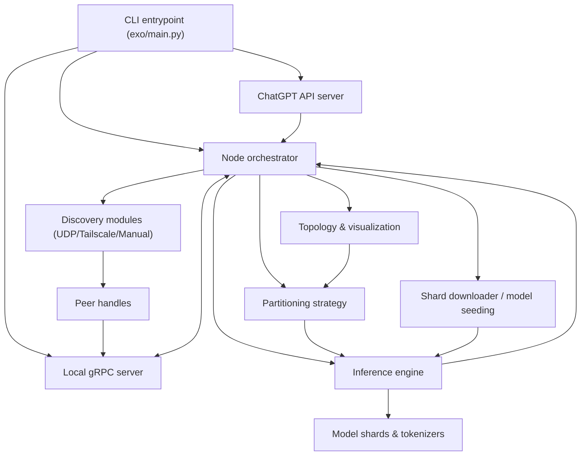

# High-Level Architecture

This diagram summarizes how exo components collaborate to expose ChatGPT-compatible APIs on top of distributed inference across peer nodes.

## Key Components

- **CLI entrypoint** (`exo/main.py`) selects the inference engine, configures discovery (UDP, Tailscale, or manual), creates the `Node`, gRPC server, and ChatGPT API server, and wires topology visualization callbacks. 【F:exo/main.py†L1-L194】
- **Node orchestrator** (`exo/orchestration/node.py`) maintains device topology, peer connections, download progress, and coordinates prompt/tensor processing across shards while emitting status callbacks for visualization. 【F:exo/orchestration/node.py†L1-L200】
- **Discovery & networking** (`exo/networking/grpc/grpc_server.py`) expose gRPC endpoints that exchange prompts, tensors, and topology data between peer nodes discovered via the selected module. 【F:exo/networking/grpc/grpc_server.py†L21-L173】
- **Partitioning strategy** (`exo/topology/ring_memory_weighted_partitioning_strategy.py`) divides model layers into contiguous shard ranges weighted by peer memory, informing how work is distributed. 【F:exo/topology/ring_memory_weighted_partitioning_strategy.py†L1-L18】
- **Inference engines** (`exo/inference/inference_engine.py`) define the abstract interface and dynamic selection between MLX, Tinygrad, or dummy implementations, handling prompt encoding, sampling, and tensor inference for shards. 【F:exo/inference/inference_engine.py†L1-L77】
- **ChatGPT-compatible API** (`exo/api/chatgpt_api.py`) wraps the node to accept chat completion requests, build prompts with tokenizers, and stream generated tokens to clients. 【F:exo/api/chatgpt_api.py†L1-L200】

The flow moves from the CLI initializing services, through discovery and partitioning to distribute model shards, and finally to inference engines that process prompts and return streamed completions via the API or peer gRPC channels.
