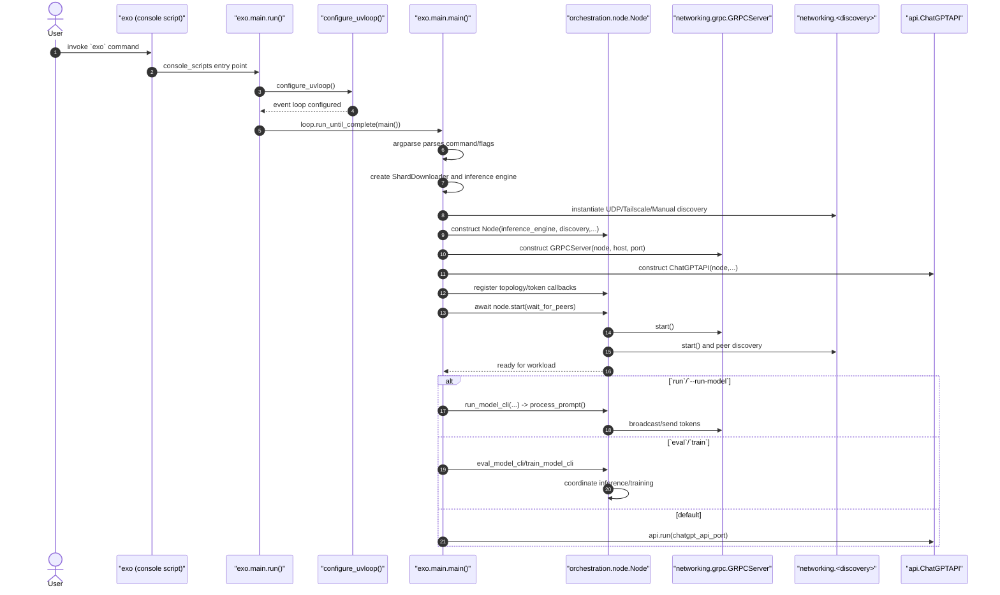

# EXO CLI execution sequence

The diagram below traces how the `exo` console entry point dispatches work across modules. It reflects the default path where the CLI starts the node, GRPC server, discovery, and optional model execution.

